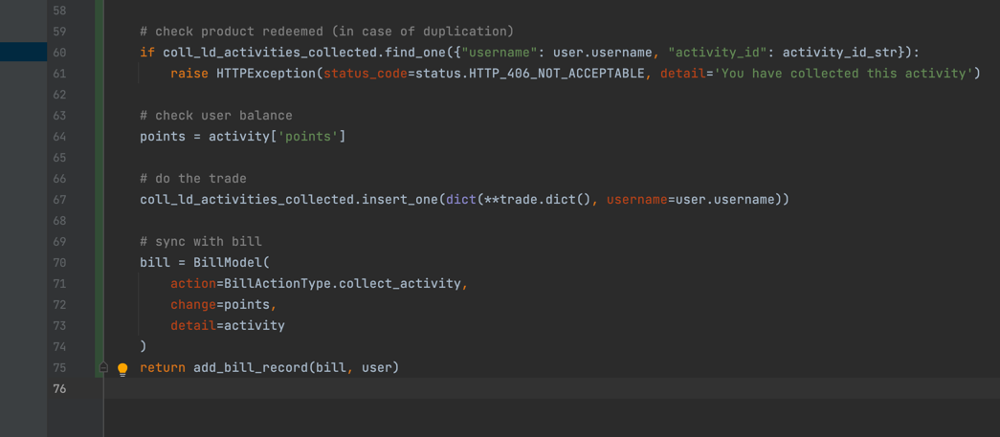

# Hand-Future Backend Dev Notes

## todo

- [ ] nginx with build

## Inspirations

### database trade model design



### smtp choice

国内的服务器使用 smtp 服务时不要用 google 的，否则会连不上，用 qq 的就可以；本地可以翻的话倒无所谓

## bugfix

### solved: `AttributeError: module 'lib' has no attribute 'OpenSSL_add_all_algorithms'`

这个问题主要是因为ubuntu系统的openssl的某些依赖没有导致的。

解决方案就是 `pip install -U pyopenssl`

但是在 `virutualenv` 环境中这么装（由于没有系统权限）会不起作用

所以要先 `deactivate` 退出到系统环境中安装，安装之前要

```shell
sudo apt remove python3-pip 
wget https://bootstrap.pypa.io/get-pip.py
sudo python3 get-pip.py
```

参考：https://stackoverflow.com/questions/73830524/attributeerror-module-lib-has-no-attribute-x509-v-flag-cb-issuer-check